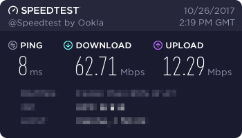
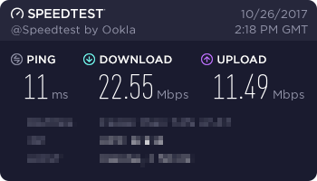

# RouteryPi

 

## Summary

RouteryPi is a WiFi access point originally based on the Raspberry Pi Zero W combined with a custom case and some status LEDs. The project has since expanded to helping users set up a WiFi access point (AP). This repo is aimed at working with Raspberry Pi OS, alternatively you could also use OpenWrt to achieve the same things (see https://openwrt.org/toh/raspberry_pi_foundation/raspberry_pi).

Note however, that using a Raspberry Pi as your main AP can be a real bottleneck for your network. In the past all Raspi models had rather bad networking features, fortunately, this changed with the Pi 4. It features an even faster CPU and more RAM than any previous model and most importantly has 2.4 and 5GHz WiFi ac and Gigabit Ethernet! You can even run the Pi over PoE with the proper header.

**Info:** Pi 4 performance still remains to be tested by me, I will update this file when I've got more information.

## Hardware

This will run on pretty much any Raspberry Pi generation aiming at the newer ones with onboard WiFi, however this probably also works with any compatible WiFi and LAN dongle.

To get the best performance possible I recommend you to use the Raspberry Pi 4 for all the before mentioned networking features. Nevertheless, this also works without a problem on a Pi Zero W for example, networking speeds will be slower though.

## Software

This build uses the latest version of Raspberry Pi OS which is based on Debian Buster. You can download it on the official Raspberry Pi website, at https://www.raspberrypi.org/downloads/raspberry-pi-os/. I guess you already know how to flash the image onto the SD Card - if you don't however, have a look at this tutorial: https://www.raspberrypi.org/documentation/installation/installing-images/

The heart of this whole installation will be 'hostapd' and 'bridge-utils' because we will be using the Pi as a network bridge between the LAN and WiFi. This means that **you will need an additonal DHCP and DNS server**. Nevertheless, this simplifies the whole installation a lot and makes it less error-prone. If you already have a router (which I assume you do) you can connect it to your RouteryPi and everything will work out of the box.

You will need no additional drivers at all!

## Installation

**Preparation**

The first step is, obviously, to install the image onto the uSD Card and booting it up. The first boot usually takes longer than a normal startup because the Pi has to do first time stuff like generating new SSH keys and so on.

Then use `sudo raspi-config` to configure the Pi to your likings.

Now update it using `sudo apt update && sudo apt full-upgrade` - once it's done reboot it and we'll start with the actual AP installation.

**AP setup**

Firstly, install hostapd and bridge-utils with the following command.
```
sudo apt install hostapd bridge-utils
```

Now comes the important part. The next step is editing the hostapd.conf.
```
sudo nano /etc/hostapd/hostapd.conf
```

If the file is not empty just delete it's content. We will be using a custom config anyways. The minimal config that you should use looks like that:
```
# Bridge mode
bridge=br0

# Networking interface
interface=wlan0

# WiFi configuration
ssid=RouteryPi
channel=1
hw_mode=g
country_code=US
ieee80211n=1
ieee80211d=1
wmm_enabled=1

# WiFi security
auth_algs=1
wpa=2
wpa_key_mgmt=WPA-PSK
rsn_pairwise=CCMP
wpa_passphrase=SomeStrongPassword
```
Just paste the text into the hostapd config file, edit `country_code=US` to your country, save it and you're good to go.
You should then update `wpa_passphrase` to your custom WiFi password and optionally `channel` to another WiFi channel.

To create and use the network bridge we only have to edit one more file. Now edit the network interfaces file like that:
```
sudo nano /etc/network/interfaces
```

Delete anything that's in here and paste the following configuration:
```
auto lo
iface lo inet loopback

# Ethernet
auto eth0
allow-hotplug eth0
iface eth0 inet manual

# WiFi
auto wlan0
allow-hotplug wlan0
iface wlan0 inet manual
wireless-power off

# Bridge
auto br0
iface br0 inet dhcp
bridge_ports eth0 wlan0
bridge_fd 0
bridge_stp off
```
This will result in the Pi using DHCP which means it can be used in **any existing** network. The downside of this is that you have to find out the IP address if you want to, let's say, use SSH. You could use a static IP address by changing the **br0**(!) interface config a little bit - just google 'static ip raspberry pi'. (For the lazy: https://duckduckgo.com/?q=static+ip+raspberry+pi) **Info: I will update this section with instructions on how to do so.**

**Final steps**

After you did a quick reboot using `sudo reboot`, you can start testing the whole thing. To test the hostapd config use this command: `sudo hostapd /etc/hostapd/hostapd.conf`. Note: If it does exit without you doing something, then there is something wrong with it. To go into debug mode use `sudo hostapd -dd /etc/hostapd/hostapd.conf`.

While testing the hostapd config you can also try connecting as a client. If you've done everything correctly you should be able to do so without any problems.

To enable hostapd to run upon boot you have to edit one last file.
```
sudo nano /etc/default/hostapd
```

Now paste this text into the file and save it:
```
RUN_DAEMON=yes
DAEMON_CONF="/etc/hostapd/hostapd.conf"
```

You're ready to go! From now on hostapd will start whenever your Pi boots up.

## Autostart issue

Some users reported issues with the above mentioned method of autostarting hostapd. From hostapd's side this should all work, but for some reason it looks like Raspbian doesn't like that anymore. The latest workaround is to paste the following commands to overwrite Raspbian's default masking of hostapd. See issue #5 for more info.

```sh
sudo systemctl unmask hostapd
sudo systemctl enable hostapd
sudo systemctl start hostapd
```
**Info: I will update this section after testing if the issue still exists.**


## Speed

I tested my RouteryPi - a Raspberry Pi W - under the following conditions:



One thing to take into consideration is that I (unfairly) tested my 5GHz WiFi which the Raspberry Pi Zero W cannot provide. **Info: I will update the speed test for different models and also using the same WiFi frequency.** I have to admit the RouteryPi's results are not that great, especially compared to my normal connection. But if you don't have a fast connection in the first place, this will be sufficent. Although the results seem pretty poor, I tested if you could watch Full HD (1080p) Youtube videos and play a little game like Minecraft on a server and it worked just fine!



## Optional

* You could add an automatic speedtest with [speedtest-cli-extras](https://github.com/HenrikBengtsson/speedtest-cli-extras) by utilizing crontab and outputting the results in a file. You'll have more convincing arguments when contacting your ISP in case something's not working again ;)

* You could remove some unused software from your pi to decrease the disk size even more - although this will only clean up some 10s of MBytes. Raspbian Lite is already pretty slim. Stuff you could remove would be e.g. vim-common, triggerhappy, bluez and so on. You can get a list of all installed packages by typing `apt list --installed`. Don't forget to do `sudo apt autoremove` afterwards!

* You could also solder an external antenna onto the Pi if you aren't satisfied with it's range. The Pi Zero W has tiny solder pads for soldering a U.FL RF connector. Together with a small adapter cable you could use your standard WiFi antennas. You can read into this with a nice tutorial like this one: https://www.briandorey.com/post/raspberry-pi-zero-w-external-antenna-mod

* Security related (OLD): Raspbian Stretch or newer is **no longer vulnerable to the WPA2 Krack attack**. Since the system got patched you are totally safe with using any Raspberry Pi as AP or client **as long as all your other devices are secure**. So please always update your system!
